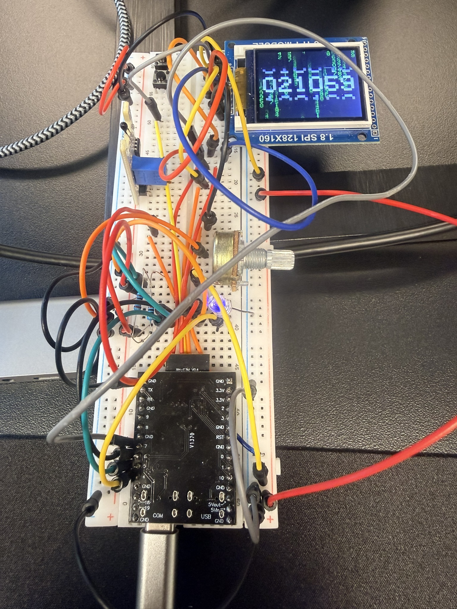

# Random Number Wheel Counter

ESP32-C3 DevKitM + 1.8 inch ST7735 SPI TFT running a Zephyr animation demo.
The display combines a falling Matrix-style number rain background with six
large transparent number wheels that spin and stop independently on a new
random value.



## What This Is

The firmware renders each frame in RGB565, rotates the logical drawing area
to landscape mode, and sends the complete frame directly to the TFT over SPI.
The wheel animation uses easing so each digit appears to slow down naturally.

| Area | Files |
| --- | --- |
| Application timing and frame order | `src/main.c` |
| ST7735 SPI driver | `src/st7735.c`, `src/st7735.h` |
| Landscape framebuffer | `src/screen.c`, `src/screen.h` |
| Matrix number rain | `src/matrix.c`, `src/matrix.h` |
| Rolling number wheels | `src/number_wheels.c`, `src/number_wheels.h` |
| Shared 5x7 digit font | `src/digit_font.c`, `src/digit_font.h` |
| ESP32-C3 pin and SPI setup | `boards/esp32c3_devkitm.overlay` |

## Demo Video

[Open the demo video](src/IMG_4645.MOV)

## Hardware

| Part | Notes |
| --- | --- |
| MCU | ESP32-C3 DevKitM |
| Display | 1.8 inch SPI TFT, ST7735-compatible |
| Native display size | 128 x 160 pixels |
| Application layout | 160 x 128 pixels, landscape |
| Color format | RGB565 |
| RTOS | Zephyr |

Default signal assignments:

| TFT signal | ESP32-C3 GPIO | Defined in |
| --- | ---: | --- |
| MOSI / SDA | GPIO3 | `boards/esp32c3_devkitm.overlay` |
| SCK / SCL | GPIO7 | `boards/esp32c3_devkitm.overlay` |
| CS | GPIO1 | `src/st7735.c` |
| DC / A0 | GPIO2 | `src/st7735.c` |
| RST | GPIO0 | `src/st7735.c` |
| VCC, GND, BL | Power and backlight wiring | Hardware dependent |

## Build

From the Zephyr workspace:

```powershell
west build -p always -b esp32c3_devkitm/esp32c3 path\to\Random_number_wheel_counter
```

## Flash

```powershell
west flash
```

If the display is blank, check `CS`, `DC`, `RST`, `MOSI`, and `SCK` first.
The ST7735 initialization and orientation settings are in `src/st7735.c`.
